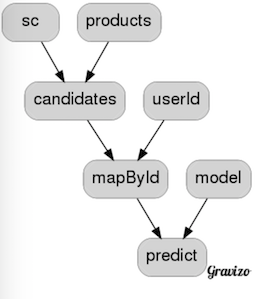
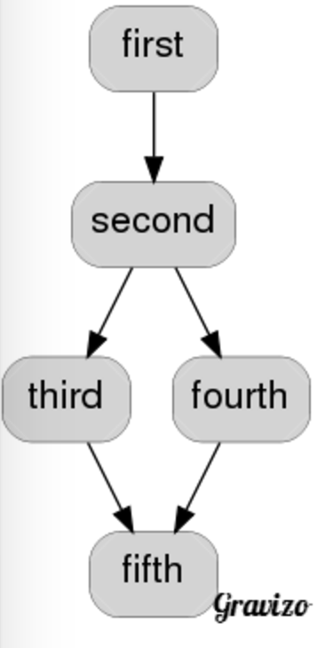

#Recommender Engine FLow

     
         
    //    val ratings = addRandomLongColumnFn(ratingsFn)
    //    val model = train(trainingFilterFn(ratings), validationFilterFn(ratings))
    //    val testRmse = computeRmse(model, testingFilterFn(ratings))
    
        val graph = DAG("recommender",
          List("data"),
          List("ratings", "data"),
          List("training", "ratings"),
          List("validation", "ratings"),
          List("testing", "ratings"),
          List("model", "training", "validation"),
          List("rmse", "model", "testing"))
    
    
        val ops = OperationBuilder(graph,
          Map("data" -> ratingsFn),
          Map(
            "ratings" -> addRandomLongColumnFn _,
            "training" -> trainingFilterFn _,
            "validation" -> validationFilterFn _,
            "testing" -> testingFilterFn _,
            "model" -> (train _).tupled,
            "rmse" -> (computeRmse _).tupled
            )
          )
         
              
#Implicits (functions as operations)

 
             
      val f_str = { i: Int => i.toString }
      val f_bang = { s: String => s + "!" }
      val f_hash = { s: String => s + "#" }
      val f_concat = { s: (String, String) => s._1 + s._2 }
    
      "function examples" should {
    
        val logic: String = {
          val i = 7
          val s = f_str(i)
          val b = f_bang(s)
          val h = f_hash(s)
          f_concat(b, h)
        }
    
        "composition" in {
          logic shouldBe "7!7#"
        }
      }
      
          "diamond" in {
            def flow(start: Int) = {
              for {
                startOp <- Root[Int](start)
                s1 <- transformerIntToString(startOp)
                s2 <- transformerAppendBang(s1)
                s3 <- transformerAppendHash(s1)
                s4 <- transformerConcatenate(s2, s3)
              } yield s4
            }
      
            flow(7)() shouldBe "7!7#"
          }
  
  
                
#Spark examples             
        
      "Spark examples" should {
    
        val scStart: Operation[SparkContext] = SparkProvider("test")(LOCAL)
    
        val scStop = Transformer[SparkContext, Unit] { _.stop() }
    
    
        val wordsRDD: SparkOperation[RDD[String]] = SparkOperation[RDD[String]] { sc =>
          sc.makeRDD("There is nothing either good or bad, but thinking makes it so".split(' '))
        }
    
        val aWords = RDDTransformer[String, String] { rdd => rdd.filter(_.contains("a")) }
        val bWords = RDDTransformer[String, String] { rdd => rdd.filter(_.contains("b")) }
    
        val countOperation = Transformer[RDD[String], Long] { _.count }
    
        "words" in new TryExecutor {
          val operation = scStart --> wordsRDD // same as wordsRDD(sc)
          val result: Try[RDD[String]] = execute(operation)
          result.get.count() shouldBe 12
        }
    
        "letter count" in new FutureExecutor {
          import scala.concurrent.ExecutionContext.Implicits.global
    
          val flow = for {
            sc <- scStart
            words <- wordsRDD(sc)
    
            aWords <- aWords(words)
            countA <- countOperation(aWords)
    
            bWords <- bWords(words)
            countB <- countOperation(bWords)
    
            //_ <- scStop(sc)
          }
            yield (countA, countB)
    
          val futureResult = execute(flow)
    
          whenReady(futureResult) { result =>
            scStart().stop()
            result shouldBe (2, 2)
          }
        }
      }
  
#Free Monads

    class OpSuite extends WordSpec with ShouldMatchers with Logging with ScalaFutures {
    
      val f_str = { i: Int => i.toString }
      val f_bang = { s: String => s + "!" }
      val f_hash = { s: String => s + "#" }
      val f_concat = { s: (String, String) => s._1 + s._2 }
    
      "function examples" should {
    
        val logic: String = {
          val i = 5
          val s = f_str(i)
          val b = f_bang(s)
          val h = f_hash(s)
          f_concat(b, h)
        }
    
        "composition" in {
          logic shouldBe "5!5#"
        }
    
      }
    
      "op examples" should {
    
        val op = Op(5)
        val str: Tr[Int, String] = f_str
        val bang: Tr[String, String] = f_bang
        val hash: Tr[String, String] = f_hash
        val concat: Tr[(String, String), String] = f_concat
    
        val logic: Free[External, String] = for {
          i <- op
          s <- str(i)
          b <- bang(s)
          h <- hash(s)
          c <- concat(b, h)
        } yield c
    
        "id" in {
    
          val result = logic.foldMap(idInterpreter)
    
          result shouldBe "5!5#"
        }
    
        "future" in {
    
          val futureResult = logic.foldMap(futureInterpreter)
    
          whenReady(futureResult) { result =>
            result shouldBe "5!5#"
          }
        }
    
        "log" in {
          logic.foldMap(logInterpreter)
        }
      }
    }
    
#Interesting projects

[https://github.com/intentmedia/mario](https://github.com/intentmedia/mario)

[https://github.com/springnz/sparkplug](https://github.com/springnz/sparkplug)

[https://github.com/joefrost01/scalaDAGMan](https://github.com/joefrost01/scalaDAGMan)